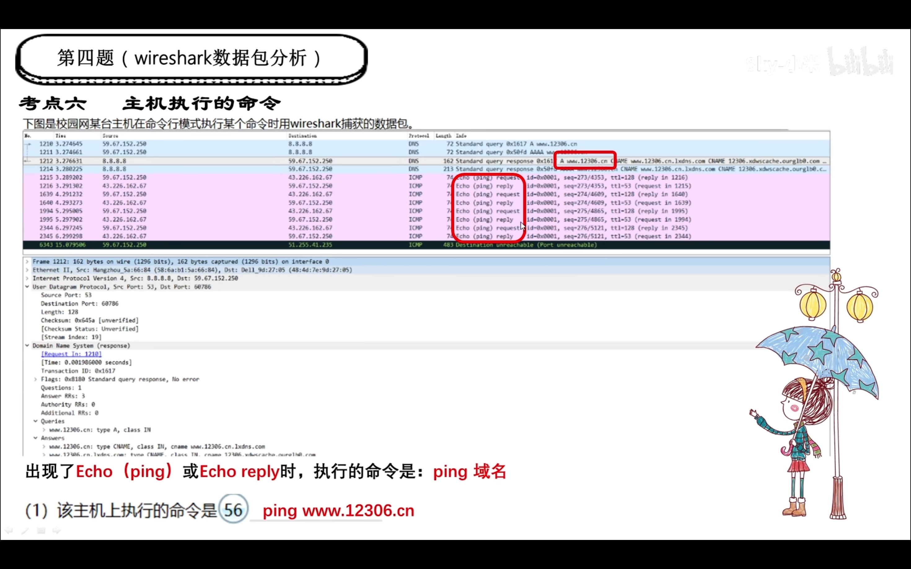
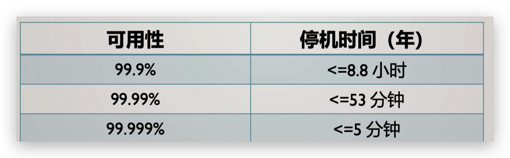
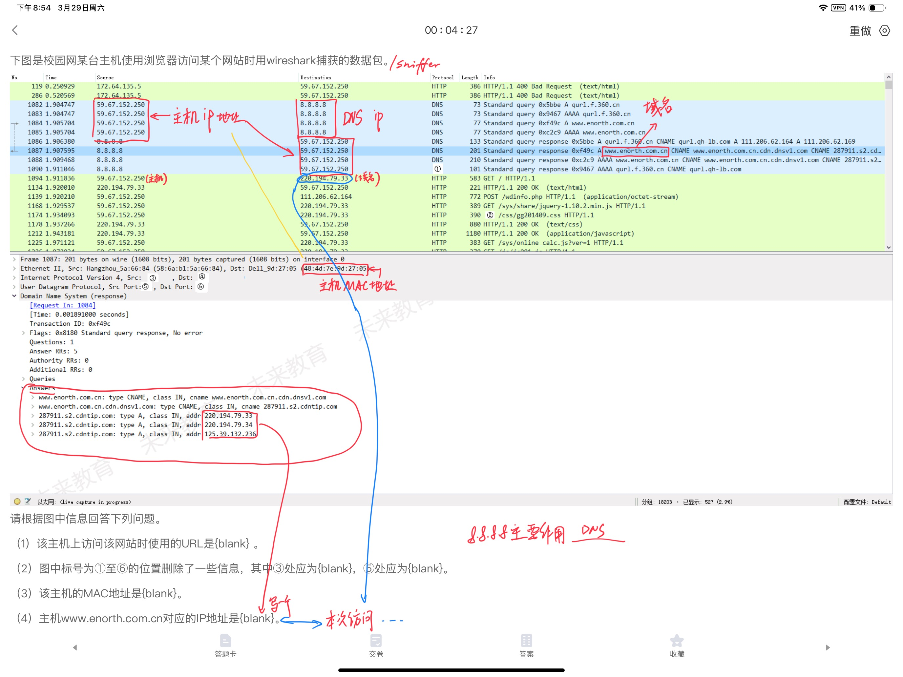

# 第一章
---
## ✅Qos技术(考属于不属于)
**Differ
MPLS  名牌老师
RSVIP  VIP

## ✅RPR(弹性分组环)
**SRP公平算法
源节点——目的节点
50ms
外顺内逆
100公里
内外都可传输+控制,统计复用(频分No)

## ✅传输速率Oc-
**乘50就行

## ✅无线接入技术
	ADSL非对称
Ad hoc
WLAN,WiFi
WiMAX
WMAN
802.11_

## 宽带城域网技术
**对内很传统（电信网络），对外很洋气（SNMP）
核心-汇聚(中间)-接入
	*核心: 选接入
	!汇聚:两个接入一个核心(中间)

## !光以太网技术
**支持 MPLS(名牌老师)
提供 QoS 服务
贞,不是信源(性)
5个9——99.999% 

## 接入技术
**🌟ADSL 非对称(64,640)
100KM
CM频复法将信道分上下
全双工❌
HDSL对称
802.11a——54Mbps

# 第二章
---
## 路由器
**🌟背板能力(🌰高速公路宽度)➡️决定➡️吞吐量(包转发能力,❌路由表容量)
🌟丢包率(🌰快递小哥,累了崩溃了就丢)是超负荷工作指标之一
🌟高性能路由器采用交换式结构(”共享“背板❌,🌰共用一根吸管) 
	队列管理机制：队列调度算法和拥塞管理机制
	突发处理能力以最大发送速率衡量(🌰看上限)
	路由器的服务质量表现在3个方面(一个❌)
	语音和视频对抖动要求高
	路由器的包转发能力与数量，速率，长度，类型有关
	最大可堆叠数不是路由器的性能指标

## 停机时间  

**5个9是5分钟
525547

## 🌑服务器技术
**🌟一台主机出现故障不会影响服务，但会影响性能
热插拔功能在不断电的情况下更换硬盘，板卡和电源(❌煮背板)
磁盘性能表现在容量 and I/O速度
Unix 是对的,安卓和 windows 是错的

# 第三章
---
## BGP(边界网关协议)
🌟**TCP(不是UDP)(🌰🌐 BGP = 互联网的"跨国快递公司")
update(更新)通知
keepalive周期性交换(❌不定期)
AS➡️无脑选➡️BGP(❌同一自治系统)
路由向量协议

## OSPF(内部网关协议)
**分布式链路状态协议
“度量”:费用,距离,延时,带宽(❌”主要“不能少,❌收敛时间)
数据库:全网的拓扑结构图
路由器:本区域的拓扑结构信息
32位
不超过200个 
洪泛法,所有(❌相邻)
最短路径算法

## RIP
**DVD
	矢量D(❌V)
	(V,D)(❌不能反 )
在接收到更新报文后按照最短路径原则更新路由表(刷新 )
（hop count）一般小于15
## 路由协议
**OSPF & RIP———最短路径

# 第五章
---
## 集线器
**连接到一个集线器的所有结点共享/属于 （不是独立）一个冲突域
CSMA/CD
不是基于 MAC 地址/网卡地址/IP 地址
## 布线
**🌟多介质插座——连接铜缆 and 光纤
STP更好(抗干扰能力强、辐射小)
双绞线可以避免电磁干扰
ISO不是综合布线系统的标准
建筑群子系统(❌双绞线连接)

## 蓝牙
**密钥以8bit为单位增长,最长128bit
发射功率为0时,覆盖1-10米
## 其他
删除全部配置——writer erase
配置服务器域名时，可以使用域名或其它描述。（不使用该服务器的域名，不必是合格的域名）
Web 站点可以配置静态和动态 IP 地址。
接收/读取邮件时 POP3 或者 IMAP 协议
VLAN ID 标准范围是 1~1005,扩展范围是 1025~4096。
2~1000 用于 Ethenet VLANs
IEEE:1024 台 PC。点对点模式是指无线网卡和无线网卡之间的通信方式.与蓝牙干扰

# 第四大题
---
## sniffer
**命令
	ICMP:tracert mail.tj.edu.cn 
	FTP :ftp mail.ti.edu.cn 
	URL :https://mail.ti.edu.cn
## wireshark抓包

